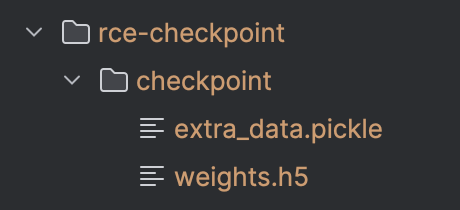

# transformer攻防工具（Transformer hacker）

仓库地址：https://github.com/llm-sec/transformer-hacker

# 一、这是什么？

transformer相关漏洞武器化，方便利用漏洞。

# 二、下载 & 安装 

## 2.1 pip一键安装

TODO 

## 2.2 源码编译

前置依赖：

- Python 

克隆仓库到本地

```bash
git clone git@github.com:llm-sec/huggingface-hacker.git 
```

安装依赖库：

```bash
# 如果要让poc.py能够运行，安装的transformers版本要是4.37.2之前的
pip install transformers==4.37.2
pip install tensorflow
```

运行main.py查看使用说明：

```bash
python main.py --help
```

# 三、生成RCE payload checkpoint

生成带有命令执行的`checkpoint`，制定模型名称和要执行的命令：

```bash
python main.py --directory ./rce-checkpoint --model bert-base-uncased --command 'open /System/Applications/Calculator.app'
```

生成的payload文件夹如下：



对于漏洞原理的解读请移步此文章：

[]()

# 四、大模型安全技术交流群

扫码加入大模型安全交流群：


如群二维码过期，可以加我个人微信，发送【大模型安全】拉你进群：


- 本工具及代码在[kimi](https://kimi.moonshot.cn/)的辅助下完成，感谢技术突破带来的生产力提升。


